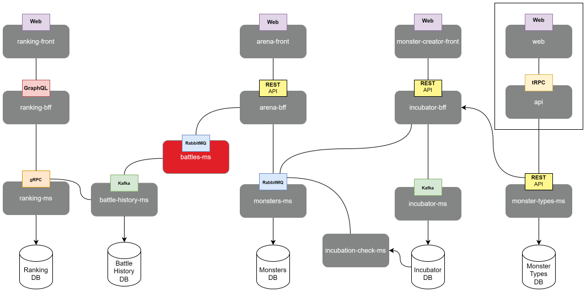

# Portfolio Battles Microservice



This is the microservice responsible for handling battle-related feature in the application.

## Installation

1. Clone this repository to your local machine:

```
git clone https://github.com/crisgarlez/portfolio-battles-ms.git
```

2. Install project dependencies:

```
cd portfolio-battles-ms
npm install
```

## Configuration

Before running the microservice, you need to configure some environment variables. Create a .env file at the root of the project and set the following variables:

```
AMQP_URL=amqp://localhost:5672
BATTLES_MS_QUEUE_NAME=battles_ms_queue
MONSTERS_MS_QUEUE_NAME=monsters_ms_queue
KAFKA_BROKER=localhost:9092
KAFKA_CLIENT_ID=portfolio-battles-ms
KAFKA_CONSUMER_ID=portfolio-battles-ms-consumer
PORT=3002
```

## Usage

To run the microservice, simply execute the following command:

```
npm start
```
